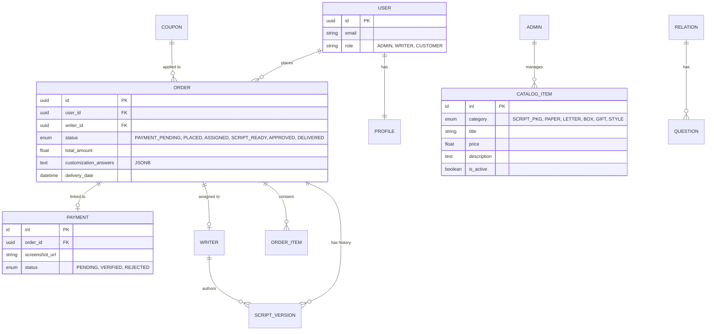

# Master PRD: Alanaatii Platform (Backend Architecture)

This document serves as the comprehensive Product Requirement Document (PRD) for the Alanaatii backend system, built using **Django REST Framework (DRF)** and **PostgreSQL**.

## 🎯 System Overview
Alanaatii is a premium letter-writing and gifting platform. The backend supports three distinct roles (Customer, Writer, Admin) and manages a multi-stage order lifecycle, including manual payment verification and professional scriptwriting.

---

## 👥 User Roles & Permissions

### 1. Customer (End User)
- **Account Management**: Signup/Login (JWT), Profile management (Address, Phone).
- **Ordering**: Multi-step configuration for Scripts, Letters, Boxes, and Gifts.
- **Payments**: Uploading manual payment proof (screenshots).
- **Tracking**: Real-time status timeline and history.
- **Collaboration**: Reviewing script drafts and requesting revisions.

### 2. Script Writer (Service Provider)
- **Work Center**: Dashboard showing assigned active scripts.
- **Script Management**: Submitting drafts, managing version history.
- **Earnings**: Tracking completed orders.

### 3. Administrator (Internal Manager)
- **Revenue Dashboard**: Real-time stats on total revenue and product-wise breakdown.
- **Verification Portal**: Manual review of payment screenshots.
- **Catalog Control**: CRUD management for all product types, styles, and gifts.
- **Writer Management**: Managing writer statuses and manual reassignment.
- **System Rules**: Managing Pricing rules, Coupons, and Customization questions.

---

## ⚙️ Core Logic: Writer Auto-Assignment

> [!IMPORTANT]
> **"Least-Loaded First" Algorithm**
> To ensure efficient turnaround and fair distribution of work, the system implements an auto-assignment logic:
> 1. When an order is moved to `ORDER_PLACED` (after payment verification):
> 2. The system queries all **Active** writers.
> 3. It calculates the count of `PENDING` script assignments for each writer.
> 4. The order is automatically assigned to the writer with the **lowest current script count**.
> 5. *Tie-breaker*: If counts are equal, the order is assigned to the writer who was assigned a task least recently.

---

## 📊 Catalog & Product Configuration

The Admin role must have full CRUD capabilities over the following entities to drive the frontend customization engine.

### 1. Script Packages
- **Fields**: `id`, `title`, `price`, `description`, `display_order`.
- **Usage**: Used when `product_type = "script"`.

### 2. Letter Papers
- **Fields**: `id`, `title`, `price`, `description`, `image_url`.
- **Usage**: Selection for physical letters or paper-only orders.

### 3. Pre-written Letters (Catalog)
- **Fields**: `id`, `category` (e.g., Love, Birthday), `title`, `base_price`, `content_template`.

### 4. Text Styles & Calligraphy
- **Fields**: `id`, `title`, `price` (extra charge for calligraphy), `preview_image`.

### 5. Boxes & Packaging
- **Fields**: `id`, `title`, `price`, `description`, `is_popular` (badge logic).

### 6. Gifts
- **Fields**: `id`, `title`, `price`, `description`, `is_custom_trigger` (if true, triggers WhatsApp contact).

---

## 📈 Revenue & Analytics Module (Admin Dashboard)

The backend must provide a centralized endpoint for real-time business health monitoring.

### 1. Core KPIs (Key Performance Indicators)
- **Total Revenue**: Sum of `total_amount` for all verified orders.
- **Total Orders**: Count of all records in the `Order` table.
- **Pending Actions**:
    - **Payment Verifications**: Count of orders with `PAYMENT_STATUS = PENDING`.
    - **Active Scripts**: Count of orders in `ASSIGNED` or `SCRIPT_SUBMITTED` status.

### 2. Detailed Revenue Breakdown
- **Product Distribution**: Total earnings and quantity sold for each `ProductType` (Script only, Letter Paper, Letter, Letter Box, Letter Box Gift).
- **Category Share**: Percentage contribution of each category to the total revenue.

### 3. Temporal Analytics
- **Trends**: Filtering of revenue and order counts by `daily`, `weekly`, `monthly`, and `yearly` timeframes.
- **Recent Activity**: A list of the 10 most recent orders with status, amount, and timestamp.

### 4. Technical Implementation
- **API Endpoint**: `GET /api/admin/dashboard/stats/`
- **Aggregation Logic**: Use Django `models.Sum` and `models.Count` with `group_by('product_type')`.
- **Caching**: The response should be cached for 5–10 minutes in **Redis** to prevent expensive DB recalculations on every page refresh.

---

## 🛠️ Administrative Management Modules

### 1. Customization Questions Hub
- **Logic**: Maps a `Relation` (e.g., Lover, Parent) to specific `Questions`.
- **Fields**: `relation_type`, `question_text`, `is_required`.
- **API**: `GET /api/questions/?relation=Lover`

### 2. Coupon & Discount Engine
- **Fields**: `code` (Unique), `discount_type` (Percentage/Flat), `value`, `min_order_amount`, `expiry_date`, `is_active`.
- **Logic**: Validates code at Checkout/Summary step.

### 3. Dynamic Pricing Rules
- **Delivery Charges**: Table mapping `Pincode Prefix` (3 digits) to `Fee`. Default to 100 if not found.
- **Service Fees**: `Express Script Fee`, `Early Delivery Surcharge` (Time-based logic).

---

## 📐 Database Architecture (PostgreSQL)

---

## 🔄 The Master Workflow

1.  **Selection**: User selects Product Type -> Customizes options.
2.  **Payment**: User uploads screenshot. Status is **Payment Pending**.
3.  **Verification**: Admin reviews screenshot. Status updates to **Order Placed**.
4.  **Assignment**: Background task runs **Least-Loaded Logic** and assigns a Writer.
5.  **Writing**: Writer submits draft. Status is **Script Submitted**.
6.  **Review**: Customer reviews (Revision Loop or Approval).
7.  **Finalize**: Status moves to **Approved** -> **Under Writing** -> **Delivered**.

---

## 🔒 Security & Performance Requirements

- **Media Storage**: Secure private S3 bucket for screenshots.
- **Caching**: Product catalogs and pricing rules in **Redis**.
- **Background Tasks**: Assignment logic and notifications managed by **Celery**.
- **Data Integrity**: Postgres transactional locking for auto-assignment.
